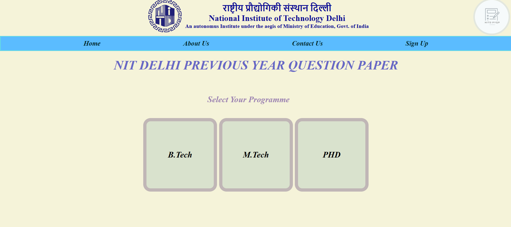
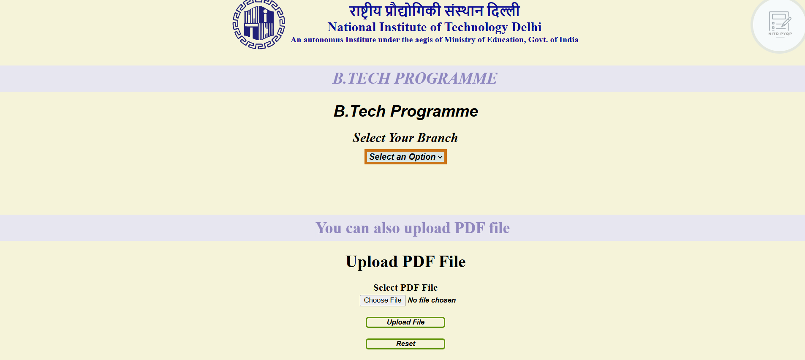
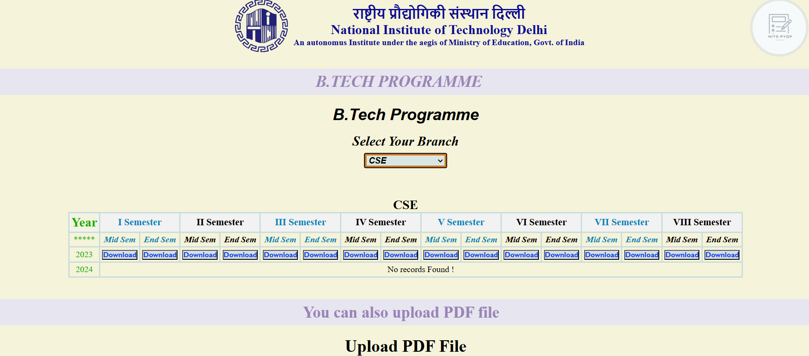
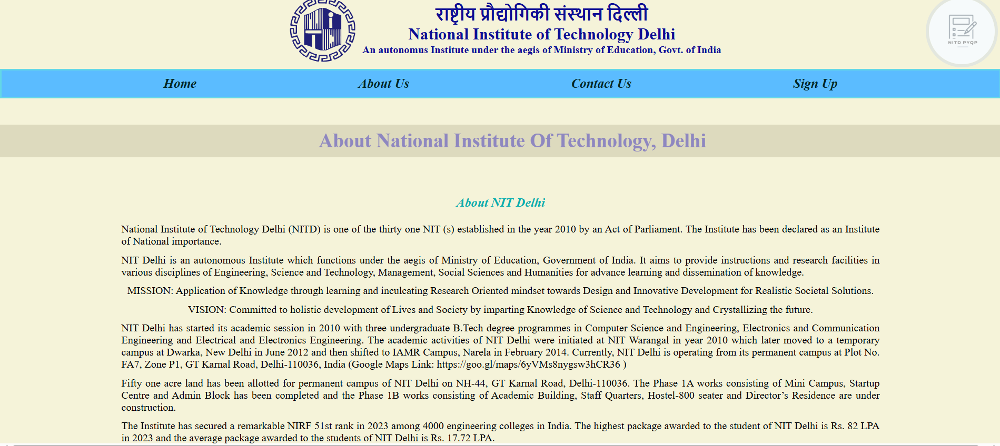
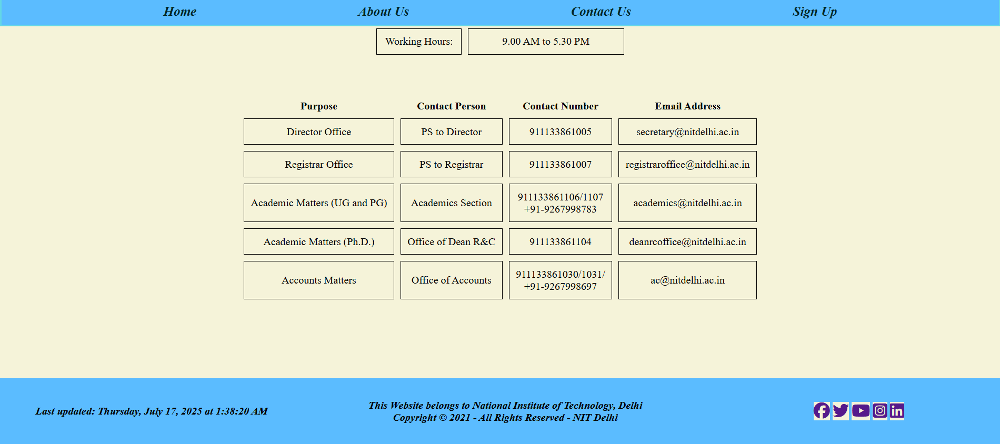
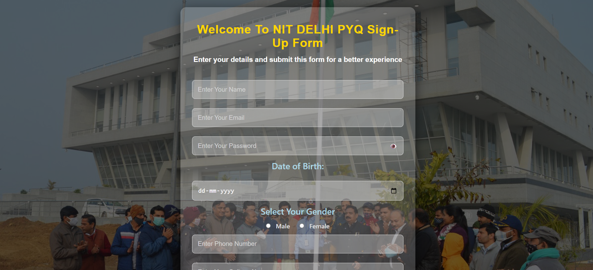
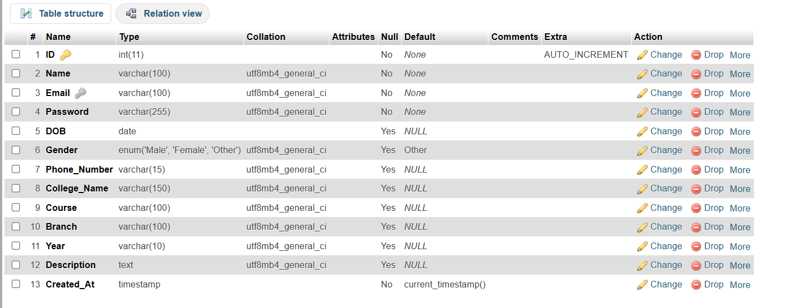
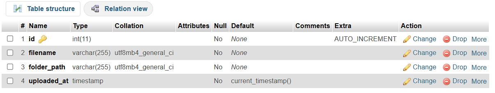
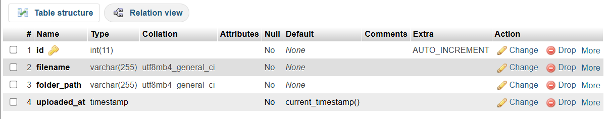

<h1 align="center">
<strong><em> NIT Delhi Previous Year Question Paper (PYQ) Portal </em></strong>
</h1>

An interactive PHP-based web portal for accessing and downloading previous year question papers of B.Tech and M.Tech programs at NIT Delhi. 

## Organized by:
- Branch (CSE, ECE, ME, etc.)
- Year (2023, 2024, etc.)
- Semester (1st to 8th)
- Exam Type (Mid/End Sem)

## Users can:
- Browse semester-wise papers
- Filter by department
- Download PDFs directly
- Admins can upload new papers securely

## Tech Stack

- PHP
- MySQL
- HTML/CSS/JS
- XAMPP / Apache

## Screenshots

### 🔹 Homepage (Branch Selection)

### 🔹 BTech Programme

### 🔹 Download Button

### 🔹 About Us

### 🔹 Contact Us

### 🔹 Sign Up

## 🗃️ Database Overview

### 🔹 sign_up Table
Stores user registration details  

### 🔹 btech Table
Stores metadata of B.Tech uploaded files  

### 🔹 mtech Table
Stores metadata of M.Tech uploaded files  

## 🙋 Author

- ***Souvik Das***
- B.Tech CSE, NIT Delhi
- [LinkedIn](https://linkedin.com/in/souvik-das-234ab9338/)
